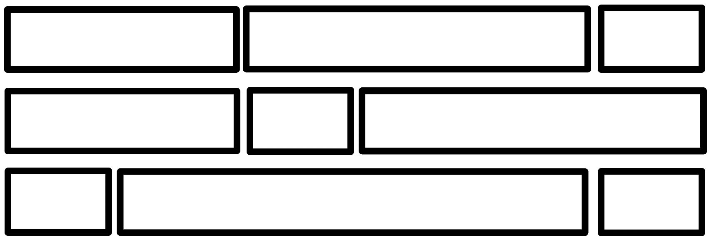

# MMWP2024 - Übungsserie 4,5 - Einführung in Bootstrap 5

Lehrveranstaltung Multimediale Webprogrammierung   Wintersemester 2024/25

Link zum Kurs: https://bildungsportal.sachsen.de/opal/auth/RepositoryEntry/46557921282  
Zum Vertiefen der Kenntnisse: https://getbootstrap.com/docs/5.3/getting-started/

### 1. Erstellen Sie eine index.html und kopieren Sie die für Bootstrap 5.3 zur Verfügung gestellte Grundstruktur

https://getbootstrap.com/docs/5.3/getting-started/introduction/#quick-start

Über die darin enthaltenen Links erhalten Sie ohne npm o.ä. Zugriff auf die Funktionen von Bootstrap.

### 2. Bootstrap verwendet ein Grid, das nativ responsiv ist.

Wie in den Beispielen zum Grid erkennbar, bietet Bootstrap vordefinierte Klassen. Dabei handelt es sich um ein Grundkonzept von Bootstrap, vordefinierte Klassen stehen für viele andere Komponenten zur Verfügung.

https://getbootstrap.com/docs/5.3/layout/grid/

2.1 Legen Sie ein 1x3 Grid an und definieren Sie für die Breakpoints sm und lg unterschiedliche Layouts für dieses Grid. An welchen Punkten werden die Layouts angewendet? Wann werden Sie nicht angewendet?

https://getbootstrap.com/docs/5.3/layout/breakpoints/

2.3 Erstellen Sie ein 3x3 Grid, konfigurieren Sie das Grid so wie in der Abbildung dargestellt. Ab einem von Ihnen gewählten, sinnvollen Breakpoint, soll das Grid in eine Spalte umgewandelt werden.

2.3 Modifizieren Sie das Grid aus 2.1 so, dass zwischen den einzelnen Elementen im Grid Freiraum entsteht. Platzieren Sie in jedem Grid-Element ein div-Element mit Text.
Visualisieren Sie die Grid-Elemente und die div-Elemente innerhalb dieser.

Was fällt Ihnen durch die Visualisierung auf? Untersuchen Sie die Elemente mit den Werkzeugen Ihres Browsers. Welche Elemente der Darstellung der einzelnen Elemente werden wie berechnet?

Padding zwischen Zeilen und Spalten wird mithilfe von Gutters implementiert.

https://getbootstrap.com/docs/5.3/layout/gutters/

https://www.w3schools.com/cssref/pr_background-color.php

### 3. Erstellen Sie zwei Elemente. Einer der Elemente soll ab dem mb-Breakpoint angezeigt werden. Das zweite Element soll ab dem md-Breakpoint nicht mehr angezeigt werden. (Es ist immer nur eines der Elemente zu sehen.)

https://getbootstrap.com/docs/5.3/utilities/display/

### 4. Legen Sie ein 1x3 Grid an und füllen Sie diese mit Text unterschiedlicher Größe.

Experimentieren Sie mit Display Headings, Lead-Paragraphen, Textformatierung, Blockquotes und Quellenangaben. Richten Sie den Text in jeder Spalte entsprechend der Position aus, bspw. die mittlere Spalte soll mittig ausgerichtet sein.

Konfigurieren Sie die Elemente responsiv. Testen Sie dies mit den Browser werkzeugen.

https://getbootstrap.com/docs/5.3/content/typography/

https://getbootstrap.com/docs/5.3/utilities/text/

https://getbootstrap.com/docs/5.3/utilities/colors/

### 5. Wählen oder Erstellen Sie ein Bild. Fügen Sie dieses Bild mit der Klasse imag-fluid ein. 

Mit dieser Klasse wird das Bild responsiv.

https://getbootstrap.com/docs/5.3/content/images/

Umranden Sie das Bild mit einem Rahmen.

Experimentieren Sie mit Containern und Grid im Zusammenhang mit Bildern. Testen Sie das responsive Verhalten.

### 6. Bootstrap bietet eine Reihe von Helper-Funktionen, um die Positionierung von Elementen zu vereinfachen.

Konfigurieren Sie ein Element so, dass es dauerhaft im oberen Bereich des Viewports sichtbar ist. Konfigurieren Sie ein weiteres Element so, dass es dauerhaft im unteren Bereich des Viewports sichtbar ist.

https://getbootstrap.com/docs/5.3/helpers/position/

### 7. Die Card Komponente stellt einen Container zur Verfügung, bei der Darstellung und Formatierung unterstützt.

Erstellen Sie eine Karte und füllen Sie diese mit Text und einem Bild. Konfigurieren Sie die Komponente so, dass sie zu jedem Zeitpunkt 25% der Bildschirmbreite einnimmt.

Welches Verhalten können Sie im Responsive Design Modus bei unterschiedlichen Bildschirmgrößen und Modi feststellen?

https://getbootstrap.com/docs/5.3/components/card/

https://getbootstrap.com/docs/5.3/components/card/#sizing

https://getbootstrap.com/docs/5.3/utilities/sizing/

### 8. Die Carousel Komponente ermöglicht das Einfügen einer Slideshow in eine Webseite.

8.1 Erstellen Sie drei Testbilder.

8.2 Konstruieren Sie ein Carousel mit drei Testbildern. Stylen Sie die Komponente so, dass die Steuerelemente des Carousels gut sichtbar sind.

https://getbootstrap.com/docs/5.3/components/carousel/

https://getbootstrap.com/docs/5.3/customize/color/

https://getbootstrap.com/docs/5.3/customize/color-modes/

### 9. Die Modal Komponente stellt eine Dialogbox zur Verfügung und ermöglicht das flexible Einfügen von Content, insbesondere bei Onepager Webseiten.

9.1 Erstellen Sie einen Button, der ein Modal Element mit einem Text und Bild anzeigt.

https://getbootstrap.com/docs/5.3/components/modal/

9.2 Erstellen Sie eine Card, die ein Modal aufruft. Überschreiben Sie das CSS so, dass sich die Card beim mit der Maus darüber hovern nicht verändert.

Hinweis: Nutzen Sie Ihre Browserwerkzeuge, um die CSS Klassen und dessen Style-Attribute festzustellen.

Selbststudienzeit/Weitere Schritte:

Nutzen Sie das Bootstrap Tutorial von W3Schools zur weiteren Auseinandersetzung mit Bootstrap:

https://www.w3schools.com/bootstrap5/
